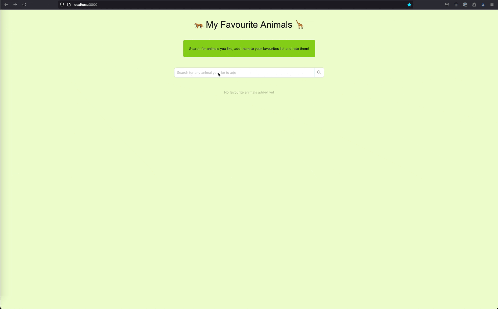

# animal-log

A simple animal rating application. Search for animals, add them to your favourites list, rate animals with stars and like / dislike their characteristics!

## Demo



## Local development

### Prerequisites

- [Node.js](https://nodejs.org/) (v20.x or later)
- [Yarn](https://yarnpkg.com/)
- API key for [**API Ninjas Animal API**](https://api-ninjas.com/api/animals)

### Steps

1. After cloning the repository install the dependencies:

   ```bash
   yarn install
   ```

2. Create a `.env` file in the root of the project and add your API keys:

   ```bash
   NEXT_PUBLIC_API_NINJAS_API_KEY=your_api_key
   ```

3. Start the development server:
   ```bash
   yarn dev
   ```
